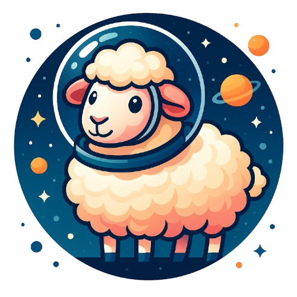
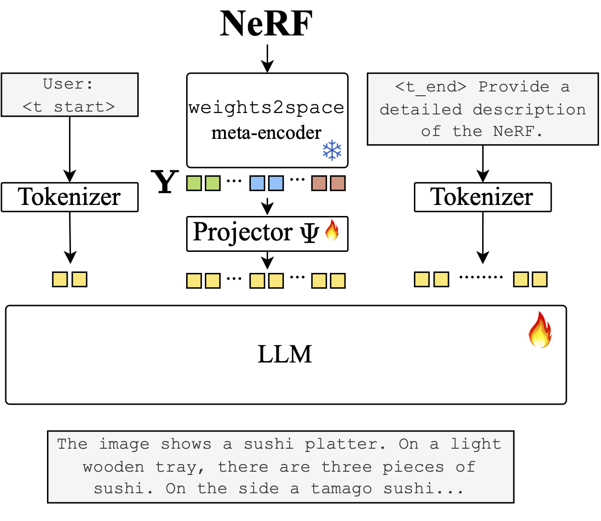
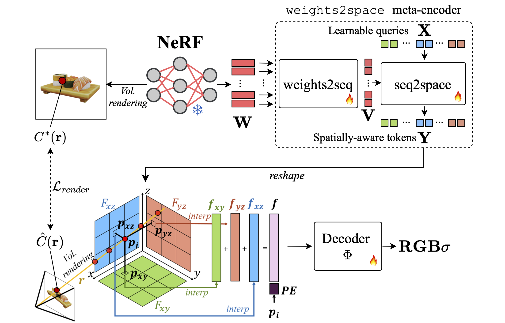

<br>
<p align="center">
<h1 align="center">&nbsp;Spatially-aware Weights Tokenization <br> for NeRF-Language Models (NeurIPS&nbsp;2025)</h1> 

  <p align="center">
    <a href='https://andreamaduzzi.github.io/' target='_blank'>Andrea Amaduzzi </a>&emsp;
    <a href='https://www.unibo.it/sitoweb/pierluigi.zama' target='_blank'>Pierluigi Zama Ramirez</a>&emsp;
    <a href='https://www.unibo.it/sitoweb/giuseppe.lisanti' target='_blank'>Giuseppe Lisanti</a>&emsp;
    <a href='https://www.unibo.it/sitoweb/samuele.salti' target='_blank'>Samuele Salti</a>&emsp;
    <a href='https://www.unibo.it/sitoweb/luigi.distefano' target='_blank'>Luigi Di Stefano</a>&emsp;
    <br>
    Computer Vision Lab, University of Bologna, Italy
  </p>
</p>

<p align="center">
  <a href="https://openreview.net/pdf/13703abced759aa01a8b08febe8467d9db596fd7.pdf" target='_blank'>
    
  </a> 
  <a href="https://andreamaduzzi.github.io/spatial-llana/" target='_blank'>
    
  </a>
  <a href="" target='_blank'>
    
  </a>
  <a href="https://github.com/CVLAB-Unibo/Spatial-LLaNA/stargazers" target='_blank'>
    
  </a>
</p>

<!-- contents with emoji -->
## 📋 Contents
- [🔧 Installation](#-installation)
- [📦 Data Preparation](#-data-preparation)
- [🧑‍🏫 Inference and Evaluation](#inference-and-evaluation)
- [🏋🏼 Training Spatial LLaNA](#-training-spatial-llana)
- [⚙️ Training weights2space](#️-training-weights2space)
- [🔗 Citation](#-citation)
- [📚 Related Work](#-related-work)
- [👏 Acknowledgements](#-acknowledgements)
- [🛑 Terms of Usage](#-terms-of-usage)

## 🔧 Installation
The code provided in this repository has been tested in the following environment:
- Ubuntu 20.04
- CUDA 12.1
- Python 3.10.0

To start: 
1. Clone this repository.
```bash
git clone git@github.com:CVLAB-Unibo/Spatial-LLaNA.git
cd Spatial-LLaNA
```
2. Install packages
```bash
conda create -n spatial-llana python=3.10 -y
conda activate spatial-llana
pip install --upgrade pip
pip install -r requirements.txt

# For faster training, install these optional dependencies:
pip install ninja
pip install flash-attn==2.5.6
```

## 📦 Data Preparation
We use ShapeNeRF-Text, ObjaNeRF-Text, and Spatial ObjaNeRF to train and evaluate our model.

### ShapeNeRF-Text
ShapeNeRF-Text provides paired NeRFs and language annotations for ShapeNet objects, in particular for all the 40K NeRFs available in [nf2vec](https://github.com/CVLAB-Unibo/nf2vec) dataset.
Such data can be downloaded from Huggingface [here](https://huggingface.co/datasets/andreamaduzzi/ShapeNeRF-Textß).

### ObjaNeRF-Text
Similar in structure to ShapeNeRF-Text, this dataset is available on Huggingface Hub [here](https://huggingface.co/datasets/andreamaduzzi/ObjaNeRF-Text). For fair comparison with existing MLLMs, the test set is split into a "PointLLM test set" and "GPT4Point test set", using distinct objects from [Objaverse](https://objaverse.allenai.org/).


### Spatial ObjaNeRF
This is our manually annotated test set of 100 complex NeRF scenes (selected from ObjaNeRF-Text) featuring detailed spatial descriptions. It's designed specifically to evaluate spatial reasoning capabilities. You can find it on the Huggingface Hub [here](https://huggingface.co/datasets/andreamaduzzi/Spatial-ObjaNeRF). We also provide spatial multiple-choice QAs for each object. 

### Required folder structure
To ensure everything runs smoothly, your data folder should look like this:

```plaintext
Spatial-LLaNA
└── data
    ├── spatial_llana_dataset
    |   |
    │   ├── train
    │   │    ├── texts
    │   │    │    ├── conversations_brief.json
    │   │    │    └── conversations_complex.json
    │   │    └── vecs     
    |   |         ├── <model_id>.npy
    |   |         └── ...
    |   |         └── <model_id>.npy
    |   |
    │   ├── val
    │   │    ├── texts
    │   │    │    ├── conversations_brief.json
    │   │    │    └── conversations_complex.json
    │   │    └── vecs     
    |   |         ├── <model_id>.npy
    |   |         └── ...
    |   |         └── <model_id>.npy
    |   |
    │   ├── shapenerf_test
    │   │    ├── texts
    │   │    │    ├── conversations_brief.json
    │   │    │    └── conversations_complex.json
    │   │    └── vecs     
    |   |         ├── <model_id>.npy
    |   |         └── ...
    |   |         └── <model_id>.npy
    |   |
    │   ├── objanerf_pointllm_test
    │   │    ├── texts
    │   │    │    └── conversations_brief.json
    │   │    └── vecs     
    |   |         ├── <model_id>.npy
    |   |         └── ...
    |   |         └── <model_id>.npy
    |   |
    │   ├── objanerf_gpt4point_test
    │   │    ├── texts
    │   │    │    └── conversations_brief.json
    │   │    └── vecs     
    |   |         ├── <model_id>.npy
    |   │         └── ...
    │   │         └── <model_id>.npy
    |   |
    │   └── hst_dataset_filtered.json
    |
    └── spatial_objanerf
        └── texts
            ├── spatial_descriptions.json
            └── spatial_multi_choice_qa.json
```

where:
1. texts/ folder contains the language annotations 
2. vecs/ folder contains the pre-computed embeddings from our weights2space encoder, to make the training smoother.

Feel free to download only the data splits you are interested in.

## 🧑‍🏫 Inference and Evaluation
You can evaluate our pre-trained model against the test sets from the paper: ShapeNeRF-Text (captioning, QA), ObjaNeRF-Text (captioning), and Spatial ObjaNeRF (spatial detailed descriptions).

All scripts use the pre-trained [andreamaduzzi/Spatial-LLaNA-13B](https://huggingface.co/andreamaduzzi/Spatial-LLaNA-13B) model by default.

### NeRF captioning 
NeRF captioning task can be evaluated on three different data sources:
1. Brief textual descriptions, from ShapeNeRF-Text
2. Brief textual descriptions from GPT2Shape HST, from [Looking at words and points with attention](https://github.com/AndreAmaduzzi/CrossCoherence)
3. Detailed textual descriptions, from ShapeNeRF-Text
4. Brief textual descriptions from ObjaNeRF-Text. To ensure a fair comparison in our paper, we split this set into a "PointLLM test test" and "GPT4Point test set", involving different sets of objects from Objaverse.
5. Detailed spatial descriptions, from Spatial ObjaNeRF

```bash
python spatial_llana/eval/eval_spatial_llana.py --model_name andreamaduzzi/Spatial-LLaNA-13B --split shapenerf_test --text_data brief_description
```

```bash
python spatial_llana/eval/eval_spatial_llana.py --model_name andreamaduzzi/Spatial-LLaNA-13B --split hst
```

```bash
python spatial_llana/eval/eval_spatial_llana.py --model_name andreamaduzzi/Spatial-LLaNA-13B --split shapenerf_test --text_data detailed_description
```

```bash
python spatial_llana/eval/eval_spatial_llana.py --model_name andreamaduzzi/Spatial-LLaNA-13B --split objanerf_pointllm_test
```

```bash
python spatial_llana/eval/eval_spatial_llana.py --model_name andreamaduzzi/Spatial-LLaNA-13B --split objanerf_gpt4point_test
```

```bash
python spatial_llana/eval/eval_spatial_llana.py --model_name andreamaduzzi/Spatial-LLaNA-13B --split spatial_objanerf
```

### NeRF QA
NeRF QA task can be evaluated by using the single-round questions and answers, belonging to the test set of ShapeNeRF-Text Dataset.
```bash
python spatial_llana/eval/eval_spatial_llana.py --model_name andreamaduzzi/Spatial-LLaNA-13B --split shapenerf_test --text_data single_round
```

All these scripts generate the textual predictions of Spatial LLaNA, that will be stored in json files.

### Computation of the evaluation metrics
The above scripts generate JSON files containing the model's predictions. Use the following script to compute the final metrics (e.g., SentenceBERT, BLEU, ROUGE):

```bash
python spatial_llana/eval/traditional_evaluator.py --results_path PATH_TO_RESULTS
```
Replace `PATH_TO_RESULTS` with the path to your JSON prediction file.


## 🏋🏼 Training Spatial LLaNA
<p align="center">
  
</p>

Spatial LLaNA is trained on the combined ShapeNeRF-Text and ObjaNeRF-Text datasets, totaling over 300K annotated NeRFs. Training relies on the embeddings pre-computed by our `weights2space` encoder, which you'll find in the `vecs/` directories.
### Training Stage 1: modality alignment
This stage optimizes the linear projection network that maps NeRF features to the LLM's embedding space.

```bash
bash scripts/Spatial-LLaNA_train_stage1.sh
```

### Training Stage 2: fine-tuning
Here, we jointly finetune the linear projection network along with the LLaMA-2 LLM.
```bash
bash scripts/Spatial-LLaNA_train_stage2.sh
```

These scripts launch the training of the model on multiple nodes, each with 4 GPUs.
You can adjust https://huggingface.co/andreamaduzzi/Spatial-LLaNA-13Bmodel_name_or_path` to train the 7B or the 13B version. The LLM we use is [Llama-2-7b](https://huggingface.co/meta-llama/Llama-2-7b-hf) and [Llama-2-13b](https://huggingface.co/meta-llama/Llama-2-13b-hf).

### Computational Resources
* **Spatial-LLaNA-7B**: Requires 8 A100 GPUs for training.

* **Spatial-LLaNA-13B**: Requires 16 GPUs for training.

* **Duration**: Completing both stages takes roughly 1 day of training. The resulting model weights will be saved in the outputs directory.

## Checkpoints of trained Spatial LLaNA
Don't want to train? No problem! Our trained models are ready on the Huggingface Hub:
* **Spatial-LLaNA-7B**: [andreamaduzzi/Spatial-LLaNA-7B](https://huggingface.co/andreamaduzzi/Spatial-LLaNA-7B)
* **Spatial-LLaNA-7B**: [andreamaduzzi/Spatial-LLaNA-13B](https://huggingface.co/andreamaduzzi/Spatial-LLaNA-13B)


## ⚙️ Training weights2space
<p align="center">
  
</p>

If you want to train our weights2space encoder from scratch, you are in the right place to learn how to do that!

### Preparing the training datset
The file `weights2space/data/train.json` lists all paths to the NeRF weights and rendered views used for training (around 350K NeRFs from ShapeNeRF-Text and ObjaNeRF-Text, including augmentation).

⚠️ Important Data Note: The underlying NeRF weights used for training weights2space are currently not released. We are working on making them available soon!


#### Launching the training of the model
```bash
cd weights2space
bash scripts/train_weights2space_parallel.sh
```
This script is configured to support parallel training of `weights2space` across multiple nodes, each with 4 GPUs.


## 🔗 Citation

If you find our work helpful, please consider starring this repo 🌟 and cite:

```bibtex
@InProceedings{NeurIPS25,
  author       = "Amaduzzi, Andrea and Zama Ramirez, Pierluigi and Lisanti, Giuseppe and Salti, Samuele and Di Stefano, Luigi",
  title        = "Spatially-aware Weights Tokenization for NeRF-Language Models",
  booktitle    = "Advances in Neural Information Processing Systems (NeurIPS)",
  year         = "2025",
  month        = "Dec."
} 
```

## 📚 Related Work
- [LLaNA](https://proceedings.neurips.cc/paper_files/paper/2024/file/026211b600a8d54760a87d78b16d9153-Paper-Conference.pdf): Our codebase is built upon this work.
- [PointLLM](https://arxiv.org/pdf/2308.16911)
- [3D-LLM](https://arxiv.org/pdf/2307.12981)
- [GPT4Point](https://arxiv.org/pdf/2307.12981)
- [LLaVA](https://github.com/haotian-liu/LLaVA)
- [LLAMA](https://huggingface.co/docs/transformers/model_doc/llama3)

## 👏 Acknowledgements
We acknowledge ISCRA for awarding this project access to the LEONARDO supercomputer, owned by the EuroHPC Joint Undertaking, hosted by [CINECA](https://www.cineca.it/en) (Italy).

## 🛑 Terms of Usage
By using this service, users are required to agree to the following terms: The service is a research preview intended for non-commercial use
only. It only provides limited safety measures and may generate offensive content. It must not be used for any illegal, harmful, violent, racist, or sexual purposes.
